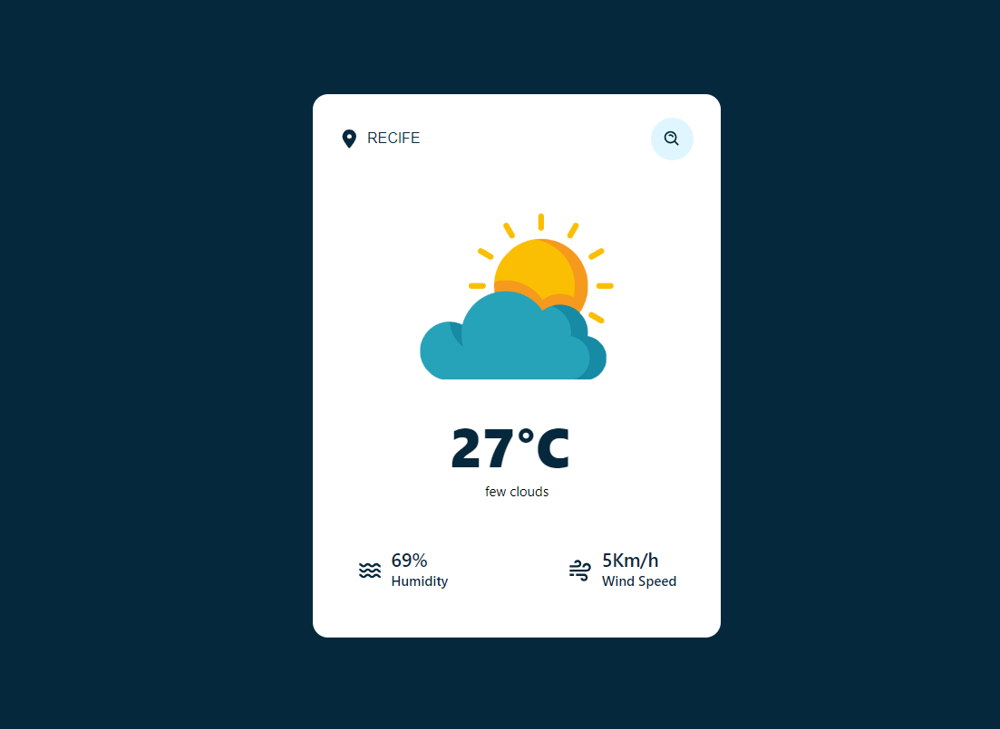

<h1 align="center">WeaForecastter ☀️</h1>
<p align="center">
  
</p>


WeaForecastter é um serviço de verificar a previsão do tempo por meio da API disponibilizada pela empresa [OpenWeather](https://openweathermap.org/)

## Instalação 💻

Siga as etapas abaixo para instalar e executar o projeto Travel Space: 

1. Faça o clone deste repositório para o seu ambiente local.
``` bash
git clone https://github.com/eupedrorodrigues/WeaForecast.git
```
2. Navegue até o diretório do projeto no terminal.
3. Execute o comando `npm install` para instalar todas as dependências do projeto
4. Gere sua Api Key no site [OpenWeather](https://openweathermap.org/)
5. Após a conclusão da instalação, execute o comando `npm run dev` para iniciar o servidor de desenvolvimento.
5. O servidor será iniciado e você poderá acessar a aplicação web WeaForecastter no seu navegador através do endereço fornecido no terminal.

## Tecnologias 

* [React](https://react.dev/) 
* [TypeScript](https://www.typescriptlang.org/)
